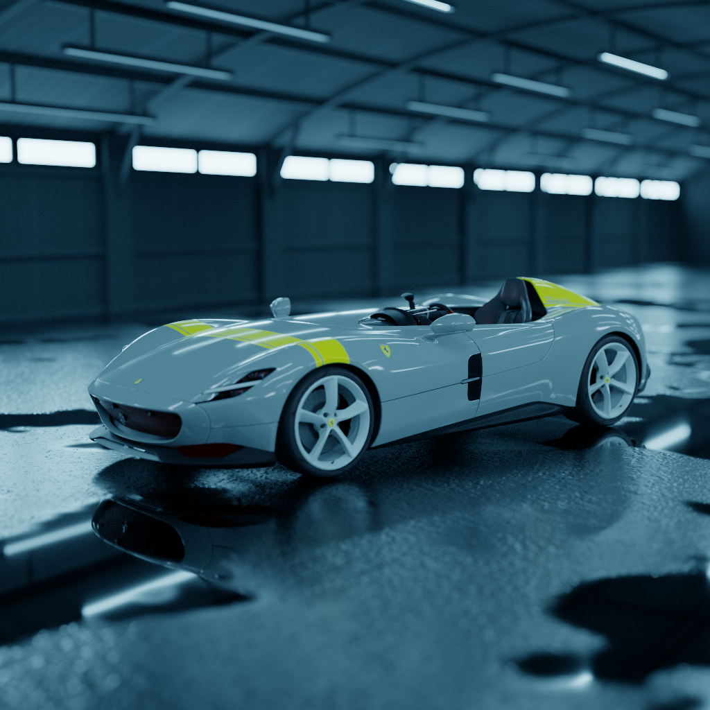
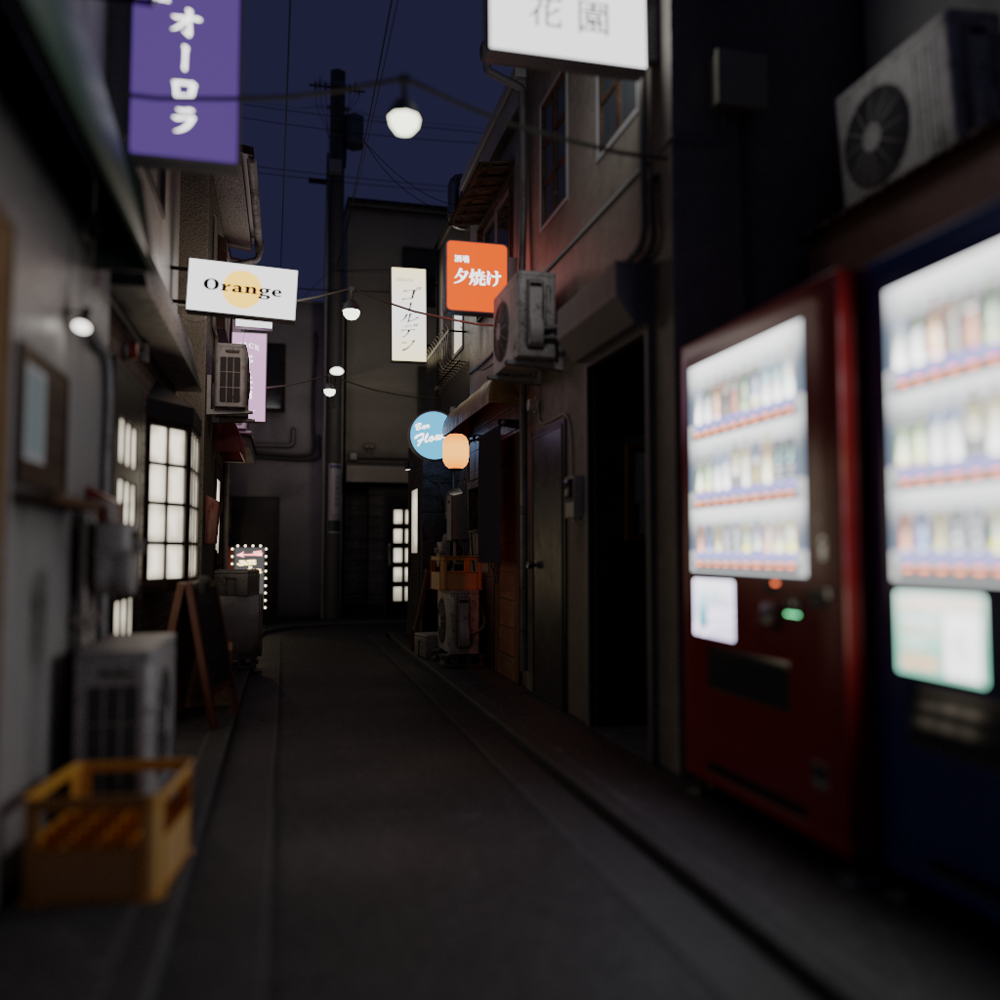
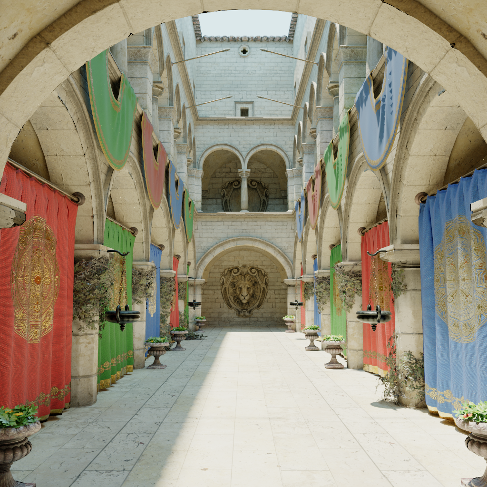

|  |  |  |

# General
This program is a path tracer built using Vulkan with ray tracing extensions. It can be run in an interactive or headless mode and takes a path to a scene description as an argument. The interactive mode opens a window and allows for moving the camera and changing parameters. The headless mode will produce an image written to persistent storage. Running with --help will display information on how to operate the program. 

Interactive mode example usage:
```
pt my_scene.scn
```

Headless mode example usage:
```
pt --headless -w1024 -h1024 -s128 -o data/my_scene.hdr -f hdr my_scene.scn
```

There are also some utility programs included, such as an MSE calculator.

# Build
The included makefile can be used to compile the program. It requires linking to Vulkan, SDL3, and Assimp. There is a debug target that can be used to build the program in debug mode, which compiles without compiler optimisations and with debug symbols, assertions, and Vulkan validation layers.

# Scene Description
A scene description file consists of two parts: the camera section and the object section. The camera section starts with `camera:` and sets the camera's parameters. The object section starts with `objects:` and defines which objects are in the scene and their instances. An object is defined by an identifier and a path to the 3D model file. An instance is defined with the object identifier followed by a number of transforms applied in the order they appear. A scaling transform is defined with `s x y z` where `x`, `y`, and `z` are the scaling factors in their respective axes. A rotation is defined with `r x y z a`, where `x`, `y`, and `z` define an axis of rotation and `a` is the angle in radians. A translation is defined with `t x y z`, where `x`, `y`, and `z` are the translations in their respective axes. 

Example scene description:
```
camera:
position -1 2 -3
lookdir -0.24 -0.06 0.97
near 1
far 1000
fov 60
exposure 10
focusdist 8
lensradius 0.03

envcol 0.375 0.45 0.9

objects:
my_object path/to/object.gltf

my_object
s 2 2 2
r 1 0 0 3.14
t 0 1 3

my_object
t -4 1 -2
```